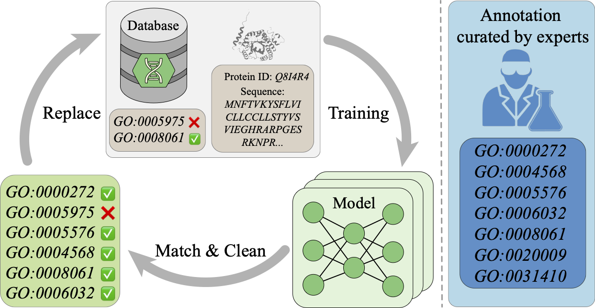

# ProtAC (under construction)

Implementation of [Recursive Cleaning for Large-scale Protein Data via Multimodal Learning](https://www.biorxiv.org/content/10.1101/2024.10.08.617190v1) by Zixuan Jiang*, Sitao Zhang*, Jiahang Cao*, Qiang Zhang, Shiyi Liu, Yuetong Fang, Lingfeng Zhang, Rui Qing, and Renjing Xu. Please feel free to reach out to us at [zjiang597@connect.hkust-gz.edu.cn](zjiang597@connect.hkust-gz.edu.cn) with any questions.

## Introduction

We introduce ***ProtAC***, which corrects large Protein datasets with a scalable Automatic Cleaning framework that leverages both sequence and functional information through multimodal learning. 

Our approach is a cyclic process consisting of three stages: first pretraining the model on a large noisy dataset, then finetuning the model on a small manually annotated dataset, and finally cleaning the noisy dataset using the finetuned model.

We achieve

1. a state-of-the-art (SOTA) model that outperforms competitors under diverse parametric levels, evaluated on multiple function-related downstream tasks

2. a cleaned UniRef50 dataset containing $\sim$50M proteins with well-annotated functions

and demonstrate that 

3. our model is able to understand the relationships between intricate functional annotations in proteins and substantiate the validity of the proposed functional annotation revisions through extensive biological analysis (please see details in our paper).

## Environment

To set up the environment and run our code, you could use the commands below in the terminal:

First clone this repo

~~~
git clone https://github.com/AzusaXuan/ProtAC.git
~~~

Then,

~~~
cd ProtAC
~~~

Use following commands to set up the environment

~~~
conda create -n protac_env python=3.9
conda activate protac_env
pip3 install -r requirements.txt # we offer this requirement list for reference, initializing the packages by yourself is encouraged
~~~

## Model weights

We provide ckpt_kw as model checkpoint for keyword-related task and ckpt for other tasks.

| Model Version    | Parameter | Layer | Head | Checkpoints                                                  |
| ---------------- | --------- | ----- | ---- | ------------------------------------------------------------ |
| ProtAC-ESM2-8M   | 29M       | 6     | 4    | [ckpt](https://huggingface.co/AzusaXuan/ProtAC/blob/main/model_weights/protac_esm2_8m.pth), [ckpt_kw](https://huggingface.co/AzusaXuan/ProtAC/blob/main/model_weights/protac_esm2_8m_kw.pth) |
| ProtAC-ESM2-35M  | 79M       | 12    | 8    | [ckpt](https://huggingface.co/AzusaXuan/ProtAC/blob/main/model_weights/protac_esm2_35m.pth), [ckpt_kw](https://huggingface.co/AzusaXuan/ProtAC/blob/main/model_weights/protac_esm2_35m_kw.pth) |
| ProtAC-ESM2-150M | 192M      | 12    | 8    | [ckpt](https://huggingface.co/AzusaXuan/ProtAC/blob/main/model_weights/protac_esm2_150m.pth), [ckpt_kw](https://huggingface.co/AzusaXuan/ProtAC/blob/main/model_weights/protac_esm2_150m_kw.pth) |
| ProtAC-ESM2-650M | 824M      | 24    | 16   | [ckpt](https://huggingface.co/AzusaXuan/ProtAC/blob/main/model_weights/protac_esm2_650m.pth) |
| ProtAC-PB        | 27M       | 6     | 4    | [ckpt](https://huggingface.co/AzusaXuan/ProtAC/blob/main/model_weights/protac_pb.pth) |

#### You could select a model version and run the chosen task using following command:

~~~
torchrun --nproc_per_node=<number_of_gpus> data_clean_main.py --mode <task_type: e.g. train, finetune, caption, eval> --checkpoint <path/to/ckpt> --depth <Layer> --attn_heads <Head>
~~~

## Evaluation

### Downstream task1: Gene Ontology (GO) prediction (7533-category)

~~~
torchrun --nproc_per_node=<number_of_gpus> data_clean_main.py --mode eval
~~~

### Downstream task2: GO prediction (MF, BP, CC)

~~~
torchrun --nproc_per_node=<number_of_gpus> run_downstream_GO.py --branch <MF/BP/CC>
~~~

### Downstream task3: Enzyme Commission (EC) prediction

~~~
torchrun --nproc_per_node=<number_of_gpus> run_downstream_EC.py
~~~

### Downstream task4: Keyword (KW) prediction

~~~
torchrun --nproc_per_node=<number_of_gpus> data_clean_main.py --mode kw_pred
~~~

### Downstream task5: GO prediction (SwissProt-753)

~~~
torchrun --nproc_per_node=<number_of_gpus> data_clean_main.py --mode caption_sw
~~~

## Cleaning workflow

### Step1: Pre-training

~~~
torchrun --nproc_per_node=<number_of_gpus> data_clean_main.py --mode train --actual_epoch <round_num>
~~~

### Step2: Fine-tuning

~~~
torchrun --nproc_per_node=<number_of_gpus> data_clean_main.py --mode finetune --actual_epoch <round_num>
~~~

### Step3: Data-cleaning

~~~
torchrun --nproc_per_node=<number_of_gpus> data_clean_main.py --mode caption --actual_epoch <round_num>
~~~

You could also run the whole workflow using `run_epochs.sh`

## Datasets

We offer original datasets for training and cleaned dataset for further training and evaluation. First five datasets have proteins in the form of untokenized suquences together with binarized GO arrays, use [GO dict](https://github.com/AzusaXuan/ProtAC/blob/main/go_dict_7533.csv) file to check corresponding GO ids; while last two datasets are with binarized keyword arrays, use [KW_dict](https://github.com/AzusaXuan/ProtAC/blob/main/kw_dict_773.csv) file to check keyword terms.

| Dataset                                                      | Amount (size) | Description                                                  |
| ------------------------------------------------------------ | ------------- | ------------------------------------------------------------ |
| [UniRef50-2018](https://huggingface.co/AzusaXuan/ProtAC/blob/main/datasets/uniref50_raw.hdf5) | ~30M (11.1GB) | Original UniRef50 dataset as of May 2018 for pre-training and captioning task |
| [UniRef50-cleaned](https://huggingface.co/AzusaXuan/ProtAC/blob/main/datasets/uniref50_cleaned.hdf5) | ~30M (11.7GB) | Cleaned UniRef50 with GO annotations created by ProtAC       |
| [SwissProt-train](https://huggingface.co/AzusaXuan/ProtAC/blob/main/datasets/swissprot_train.hdf5) | ~530K (234MB) | SwissProt dataset updated to July 2023 for pre-training and fine-tuning |
| [SwissProt-test](https://huggingface.co/AzusaXuan/ProtAC/blob/main/datasets/swissprot_test.hdf5) | ~30K (13MB)   | SwissProt dataset updated to July 2023 for evaluation        |
| [SwissProt-caption](https://huggingface.co/AzusaXuan/ProtAC/blob/main/datasets/swissprot_caption.csv) | 458 (300kB)   | Newly updated sequences in SwissProt from 2023 to January 2024 |
| [SwissProt-keyword-train](https://huggingface.co/AzusaXuan/ProtAC/blob/main/datasets/swissprot_kw_train.tar) | 18K (325MB)   | For keyword prediction task, we further split the SwissProt test set in a 3:2 ratio, assigning 18,000 sequences to the trainset and 12,000 sequences to the testset |
| [SwissProt-keyword-test](https://huggingface.co/AzusaXuan/ProtAC/blob/main/datasets/swissprot_kw_test.tar) | 12K (307MB)   | See above                                                    |

## License

The code and model weights are released under MIT license. See the [LICENSE](https://github.com/AzusaXuan/ProtAC/blob/main/LICENSE) for details.

## Citation

~~~
@article{jiang2024recursive,
  title={Recursive Cleaning for Large-scale Protein Data via Multimodal Learning},
  author={Jiang, Zixuan and Zhang, Sitao and Cao, Jiahang and Zhang, Qiang and Liu, Shiyi and Fang, Yuetong and Zhang, Lingfeng and Qing, Rui and Xu, Renjing},
  journal={bioRxiv},
  pages={2024--10},
  year={2024},
  publisher={Cold Spring Harbor Laboratory}
}
~~~

